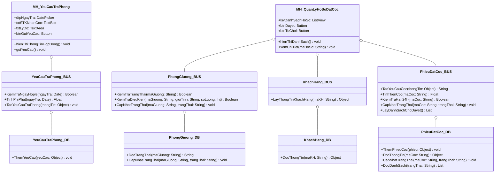
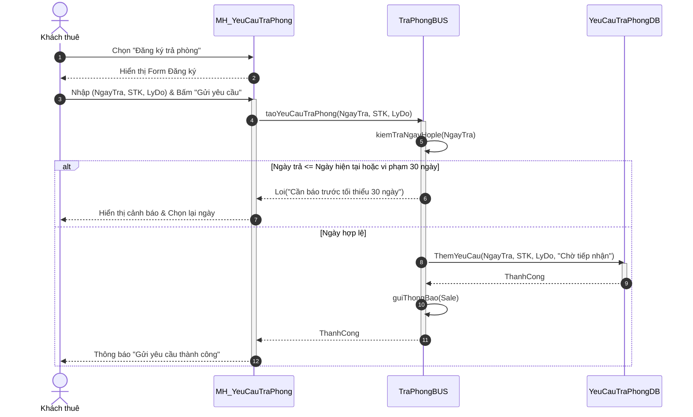

# Đặc tả Use Case: Nghiệp vụ Trả phòng

Dưới đây là toàn bộ đặc tả chi tiết của hệ thống liên quan đến quy trình **Yêu cầu trả phòng**, được trích xuất từ tài liệu của bạn.

---

## 1. UC Yêu cầu trả phòng
| Thuộc tính | Mô tả chi tiết |
| :--- | :--- |
| **Tên Use Case** | Yêu cầu trả phòng |
| **Tác nhân** | Khách thuê / Đại diện nhóm |
| **Tiền điều kiện** | Khách thuê đang ở trong phòng/giường thuê có hợp đồng đang hoạt động bình thường. |
| **Hậu điều kiện** | Yêu cầu trả phòng được gửi thành công lên hệ thống ở trạng thái "Chờ tiếp nhận", lịch hẹn kiểm tra phòng được thiết lập và thông báo cho bộ phận Sale. |
| **Luồng sự kiện chính** | 1. **Khách thuê** đăng nhập hệ thống, truy cập vào mục "Phòng thuê của tôi" và chọn nút "Đăng ký trả phòng". 2. **Hệ thống** hiển thị biểu mẫu Đăng ký trả phòng (tự động truy xuất Mã hợp đồng, Họ tên, Phòng/giường hiện tại). 3. **Khách thuê** nhập các thông tin yêu cầu: &nbsp;&nbsp;&nbsp;&nbsp;- Ngày dự kiến trả phòng mong muốn. &nbsp;&nbsp;&nbsp;&nbsp;- Số tài khoản ngân hàng để nhận lại tiền cọc. &nbsp;&nbsp;&nbsp;&nbsp;- Lý do trả phòng (Lý do cá nhân, hết hạn HĐ...). 4. **Khách thuê** kiểm tra thông tin và nhấn nút "Gửi yêu cầu trả phòng". 5. **Hệ thống** kiểm tra tính hợp lệ của ngày trả phòng dự kiến (phải sau ngày hiện tại ít nhất 1 ngày). 6. **Hệ thống** tạo Bản ghi yêu cầu trả phòng mới với trạng thái ban đầu là "Chờ tiếp nhận". 7. **Hệ thống** tự động đẩy đến bộ phận **Nhân viên Sale** để thông báo tiếp nhận yêu cầu. |
| **Luồng thay thế / Ngoại lệ** | **Ngoại lệ 5a - Ngày trả phòng không hợp lệ hoặc vi phạm quy tắc báo trước:** Tại bước 5, nếu Khách thuê chọn ngày trả phòng trong quá khứ hoặc vi phạm thời hạn báo trước tối thiểu (ví dụ theo hợp đồng bắt buộc báo trước 30 ngày đối với trường hợp trả trước hạn): 1. Hệ thống ngăn không cho gửi yêu cầu. 2. Hiển thị cảnh báo quy định: *"Theo hợp đồng, bạn cần thông báo trả phòng trước tối thiểu 30 ngày. Vui lòng chọn lại ngày trả phòng từ [Ngày X] trở đi để không phát sinh thêm phí phạt báo trễ."* 3. Cho phép khách chọn lại ngày hoặc chấp nhận phí phạt gửi trễ để tiếp tục. |

---

## 2. Sơ đồ kiến trúc 3 lớp (3-Layer Architecture)

Dưới đây là sơ đồ lớp (Class Diagram) thể hiện cấu trúc 3 tầng (UI, BUS, DB) theo chuẩn mô hình bạn đã cung cấp:

---

## 3. Sơ đồ tuần tự (Sequence Diagram) - UC Yêu cầu trả phòng

Dưới đây là sơ đồ tuần tự thể hiện sự tương tác giữa Khách thuê và các lớp trong hệ thống khi thực hiện chức năng yêu cầu trả phòng:

