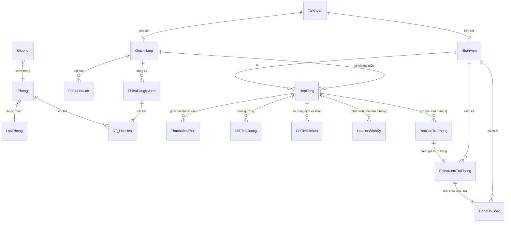
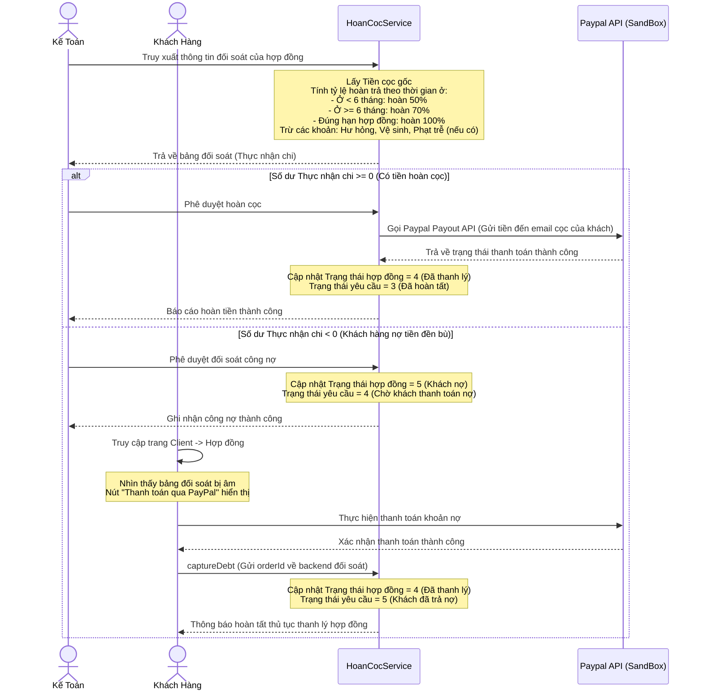

# Tài Liệu Đặc Tả Chi Tiết Dự Án: FIT 4.0 HomeStay

Tài liệu này cung cấp cái nhìn toàn diện về dự án **FIT 4.0 HomeStay** - Hệ thống quản lý ký túc xá và nhà trọ thông minh. Tài liệu bao gồm mục đích, kiến trúc hệ thống, cấu trúc cơ sở dữ liệu, phân quyền vai trò, các luồng nghiệp vụ chi tiết, và sơ đồ thư mục mã nguồn để bất kỳ lập trình viên hay quản lý dự án nào cũng có thể đọc, hiểu và tiếp tục phát triển dự án.

---

## 1. Tổng Quan Dự Án (Project Overview)

### 1.1. Mục đích
Dự án **FIT 4.0 HomeStay** được xây dựng nhằm giải quyết bài toán tối ưu hóa quy trình quản lý vận hành ký túc xá/nhà trọ, từ giai đoạn tìm kiếm thông tin của khách hàng cho đến khi ký kết hợp đồng và thanh lý hợp đồng trả phòng. Hệ thống tự động hóa các khâu dễ xảy ra tranh chấp như kiểm kê tài sản hư hỏng, tính toán mức hoàn trả cọc (đối soát tài chính) và hỗ trợ thanh toán trực tuyến tự động thông qua cổng thanh toán quốc tế **PayPal**.

### 1.2. Các Đối Tượng Hướng Tới
*   **Khách thuê (Khách hàng):** Học sinh, sinh viên, người đi làm có nhu cầu thuê chỗ ở.
*   **Đội ngũ vận hành:** Nhân viên Sale (Duyệt lịch hẹn), Quản lý tòa nhà (Kiểm kê tài sản phòng ở), Kế toán (Đối soát và duyệt hoàn cọc) và Quản trị viên (Admin - Kiểm soát toàn bộ hệ thống).

---

## 2. Kiến Trúc & Công Nghệ Sử Dụng (Tech Stack)

Hệ thống được phát triển theo mô hình Client-Server chia làm 3 phân hệ chính chạy song song:

*   **Database:** PostgreSQL 15 (Chạy trên môi trường ảo hóa Docker Container, ánh xạ cổng mặc định là `5433`).
*   **Backend Server:** Node.js sử dụng framework **Express** viết bằng **TypeScript** kết hợp công cụ biên dịch nhanh **tsx** và thư viện `pg` để tương tác trực tiếp với cơ sở dữ liệu.
*   **Frontend Admin (Quản lý nội bộ):** Sử dụng **React** (Vite), viết bằng TypeScript và giao diện được xây dựng trên **Tailwind CSS v3**.
*   **Frontend Client (Trang cho khách thuê):** Sử dụng **React** (Vite), viết bằng TypeScript và giao diện được xây dựng trên **Tailwind CSS v4** hiện đại, tối ưu hiển thị trên các thiết bị di động (Mobile-first).

---

## 3. Cấu Trúc Cơ Sở Dữ Liệu (Database Schema)

Hệ thống sử dụng cơ sở dữ liệu quan hệ PostgreSQL với các bảng chính sau:



### Chi tiết các bảng quan trọng:
1.  **TaiKhoan (Tài khoản):** Lưu trữ thông tin đăng nhập, vai trò (`Admin`, `QuanLy`, `Sale`, `KeToan`, `Khach`), trạng thái hoạt động và token bảo mật.
2.  **KhachHang / NhanVien (Khách hàng / Nhân viên):** Lưu trữ hồ sơ thông tin cá nhân liên kết trực tiếp với tài khoản.
3.  **Phong / LoaiPhong (Phòng / Loại phòng):** Lưu trữ thông tin phòng ngủ, chi nhánh, giới tính, giá phòng, sức chứa và danh sách dịch vụ phòng đi kèm.
4.  **PhieuDangKyHen (Phiếu đăng ký hẹn):** Ghi nhận thông tin khách hàng đặt lịch hẹn đến xem phòng trực tiếp.
5.  **HopDong (Hợp đồng):** Lưu trữ thông tin pháp lý thuê phòng, ngày ký, ngày hết hạn, tiền đặt cọc giữ chỗ và trạng thái hợp đồng (`1`: Mới ký, `2`: Đang hoạt động, `3`: Chờ trả phòng, `4`: Đã thanh lý, `5`: Khách nợ).
6.  **YeuCauTraPhong (Yêu cầu trả phòng):** Ghi nhận thông tin từ khách thuê mong muốn trả phòng (ngày trả, lý do, số tài khoản nhận cọc, trạng thái `1`: Chờ kiểm tra, `2`: Đã kiểm tra, `3`: Đã hoàn tất/hoàn tiền, `4`: Chờ khách trả nợ, `5`: Đã thanh toán nợ).
7.  **PhieuKiemTraPhong (Phiếu kiểm tra phòng):** Ghi nhận kết quả khảo sát thực trạng phòng khi khách trả (phí hư hỏng thiết bị, phí vệ sinh phòng, tình trạng thu hồi khóa phòng).
8.  **BangDoiSoat (Bảng đối soát tài chính):** Tổng hợp số tiền thực nhận chi sau khi lấy tiền đặt cọc trừ đi các khoản khấu trừ hư hỏng/vệ sinh hoặc phí phạt trễ hạn.

---

## 4. Phân Quyền & Vai Trò Trong Hệ Thống (Roles & Authorization)

Hệ thống phân quyền chi tiết dựa trên trường `VaiTro` (Role) trong bảng tài khoản để quyết định quyền truy cập các API của Backend và hiển thị giao diện Frontend:

| Vai Trò | Phân Hệ Sử Dụng | Quyền Hạn & Chức Năng Chính |
| :--- | :--- | :--- |
| **Khách hàng (`Khach`)** | Frontend Client | Tìm kiếm, xem chi tiết phòng; Đặt lịch hẹn xem phòng; Đặt cọc giữ chỗ qua PayPal; Xem hợp đồng cá nhân; Gửi yêu cầu trả phòng và thanh toán các khoản công nợ phát sinh. |
| **Nhân viên Sale (`Sale`)** | Frontend Admin | Quản lý và xử lý lịch hẹn xem phòng của khách hàng (Phê duyệt hoặc Từ chối lịch hẹn, hệ thống tự gửi email thông báo kết quả cho khách). |
| **Quản lý (`QuanLy`)** | Frontend Admin | Quản lý tình trạng phòng ở; Thực hiện kiểm kê tài sản và cơ sở vật chất khi khách trả phòng, ghi nhận hư hỏng, thu phí vệ sinh, thu hồi khóa; Ghi nhận/Giải quyết các khiếu nại tranh chấp của khách về việc kiểm kê phòng. |
| **Kế toán (`KeToan`)** | Frontend Admin | Thực hiện đối soát tài chính đối với các phòng đã kiểm kê xong. Duyệt bảng đối soát hoàn cọc; Kích hoạt lệnh hoàn tiền tự động qua API PayPal Payout; Ghi nhận công nợ đối với trường hợp khách đền bù vượt tiền cọc. |
| **Quản trị viên (`Admin`)** | Frontend Admin | Có toàn quyền truy cập tất cả các menu, xem dữ liệu báo cáo tổng quan và cấu hình hệ thống. |

---

## 5. Đặc Tả Luồng Nghiệp Vụ Chính (Core Business Flows)

### 5.1. Luồng Đăng Ký Lịch Hẹn Xem Phòng (Appointment Booking Flow)
Luồng này giúp kết nối khách hàng tiềm năng đến trực tiếp tham quan phòng trước khi quyết định đặt cọc.
*   **Bước 1:** Khách hàng sử dụng phân hệ Client tìm kiếm phòng theo nhu cầu (giá cả, địa điểm, sức chứa, giới tính).
*   **Bước 2:** Tại trang chi tiết phòng, khách chọn "Hẹn xem phòng", điền đầy đủ các thông tin: Họ tên, Số điện thoại, Email, Ngày hẹn, Giờ hẹn và các phòng muốn xem rồi gửi yêu cầu.
*   **Bước 3:** Hệ thống tạo một bản ghi mới trong bảng `PhieuDangKyHen` với trạng thái mặc định là `0` (Chờ xử lý).
*   **Bước 4:** Nhân viên **Sale** đăng nhập vào trang Admin, truy cập tab **Xử lý lịch hẹn** để duyệt danh sách chờ.
*   **Bước 5:** Nhân viên Sale chọn lịch hẹn, kiểm tra tính hợp lệ và nhấn **Phê duyệt** (Trạng thái = `1`) hoặc **Từ chối** (Trạng thái = `-1`), kèm theo phản hồi (Lời nhắn) cho khách.
*   **Bước 6:** Hệ thống kích hoạt dịch vụ gửi thư điện tử **Nodemailer** bất đồng bộ để gửi email thông báo kết quả phê duyệt kèm lời nhắn trực tiếp đến địa chỉ email của khách hàng.

---

### 5.2. Luồng Yêu Cầu Trả Phòng (Checkout Request Flow)
Khách hàng tiến hành gửi đơn đề xuất chấm dứt hợp đồng thuê phòng qua hệ thống.
*   **Bước 1:** Khách hàng đăng nhập vào trang Client, truy cập tab **Hợp đồng**.
*   **Bước 2:** Chọn **Yêu cầu trả phòng** và nhập các thông tin cần thiết: Ngày dự kiến trả, lý do trả phòng, Số tài khoản ngân hàng hoặc Email PayPal để nhận lại tiền cọc.
*   **Bước 3 (Kiểm tra điều kiện báo trước):**
    *   Hệ thống kiểm tra thời gian từ ngày gửi yêu cầu đến ngày dự kiến trả phòng.
    *   Nếu thời gian **nhỏ hơn 30 ngày** (Báo trễ hạn): Hệ thống sẽ hiển thị cảnh báo phạt 25% tiền cọc. Khách hàng buộc phải tích chọn đồng ý với điều khoản phạt này thì nút gửi yêu cầu mới kích hoạt.
*   **Bước 4:** Hệ thống ghi nhận yêu cầu trả phòng vào bảng `YeuCauTraPhong` với trạng thái là `1` (Chờ kiểm kê). Trong trường hợp có vi phạm báo trễ hạn, lý do sẽ được đính kèm cờ hiệu đặc biệt `[PENALTY_25]`.

---

### 5.3. Luồng Kiểm Kê Phòng & Đồ Đạc (Room Inspection Flow)
Quá trình đánh giá thực trạng tài sản trong phòng sau khi khách hàng đề xuất trả phòng.
*   **Bước 1:** **Quản lý** đăng nhập vào trang Admin, vào tab **Xử lý trả phòng** để xem danh sách phòng chờ bàn giao.
*   **Bước 2:** Quản lý đến trực tiếp phòng để kiểm kê danh mục trang thiết bị (Giường, máy lạnh, tủ từ, khóa phòng...).
*   **Bước 3:** Nhập thông tin về các lỗi hư hỏng phát hiện (mức độ nghiêm trọng của lỗi sẽ tự động quy đổi thành số tiền đền bù `phiHuHong`), phí dọn dẹp vệ sinh phòng (`phiVeSinh`), xác nhận đã thu hồi khóa cửa và khách hàng đã ký biên bản bàn giao chưa.
*   **Bước 4 (Trường hợp có Tranh chấp/Khiếu nại):**
    *   Nếu khách thuê không đồng tình với kết quả kiểm kê tài sản của Quản lý, Quản lý nhấn **Khiếu nại** trên hệ thống, nhập lý do tranh chấp. Trạng thái yêu cầu trả phòng chuyển thành `3` (Tranh chấp).
    *   Sau khi hai bên thương lượng thành công, Quản lý nhấn **Giải quyết khiếu nại** để chuyển trạng thái yêu cầu quay lại `1` (Chờ kiểm kê) để tiếp tục tiến hành kiểm kê lại.
*   **Bước 5 (Xác nhận hoàn tất kiểm kê):**
    *   Quản lý nhấn **Xác nhận bàn giao**. Hệ thống sẽ lưu thông tin phiếu kiểm tra `PhieuKiemTraPhong`.
    *   Gọi sang `PhongService` cập nhật trạng thái phòng vừa trả thành **"Trống"** để sẵn sàng đón khách thuê mới.
    *   Cập nhật trạng thái yêu cầu trả phòng sang `2` (Đã kiểm tra).

---

### 5.4. Luồng Đối Soát Tài Chính & Hoàn Cọc / Thu Nợ (Financial Reconciliation & Refund/Debt Payment Flow)
Tính toán tài chính cuối cùng, tự động hóa thanh toán hoàn trả tiền cọc hoặc xử lý nợ đền bù.



---

## 6. Sơ Đồ Cấu Trúc Thư Mục Mã Nguồn (Directory Structure)

Thư mục làm việc của dự án được tổ chức khoa học nhằm phân biệt rõ giữa Backend và Frontend:

```text
DA/ (Thư mục gốc của dự án)
├── database/                   # Chứa kịch bản SQL khởi tạo
│   ├── init.sql                # Tạo cấu trúc bảng và ràng buộc khóa ngoại
│   └── seed.sql                # Chèn dữ liệu thử nghiệm (tài khoản, phòng mẫu, v.v.)
├── docker-compose.yml          # Cấu hình container chạy Database PostgreSQL
├── SETUP.md                    # Hướng dẫn khởi chạy nhanh dự án cho lập trình viên
│
├── backend/                    # Phân hệ API Server (Express + TypeScript)
│   ├── src/
│   │   ├── config/             # Cấu hình kết nối DB
│   │   ├── controllers/        # Tiếp nhận HTTP request, điều phối xử lý logic
│   │   ├── models/             # Định nghĩa cấu trúc DTO / TypeScript Interfaces
│   │   ├── repositories/       # Thao tác truy vấn trực tiếp SQL với Database
│   │   ├── routes/             # Định nghĩa danh sách các Endpoint API của hệ thống
│   │   └── services/           # Thực thi logic nghiệp vụ (BUS - Business Logic)
│   ├── tests/                  # Viết mã kiểm thử Unit Test cho Backend
│   ├── .env.example            # Bản mẫu cấu hình biến môi trường
│   ├── .env                    # Biến môi trường thực tế (chứa port, chuỗi kết nối DB)
│   ├── reset-db.ts             # Script tự động xóa, tạo lại DB và seed dữ liệu mẫu
│   └── package.json            # Quản lý các thư viện cài đặt Backend
│
├── frontend/                   # Phân hệ Admin Dashboard (Vite + React + Tailwind v3)
│   ├── src/
│   │   ├── components/         # Các thành phần tái sử dụng (Header, Sidebar, v.v.)
│   │   ├── contexts/           # Quản lý trạng thái đăng nhập chung toàn cục
│   │   ├── pages/              # Trang chức năng (AppointmentCheck, RoomCheck, RefundCheck)
│   │   └── App.tsx             # Cấu hình định tuyến Router & phân quyền bảo mật Route
│   └── package.json
│
└── frontend_client/            # Phân hệ Client App cho khách thuê (Vite + React + Tailwind v4)
    ├── src/
    │   ├── components/         # Giao diện hộp thoại AuthModal, Bottom Nav
    │   ├── pages/              # Trang tìm phòng, đăng ký xem, làm đơn trả, thanh toán nợ
    │   └── App.tsx             # Định tuyến cho giao diện thiết bị di động
    ├── .env.example            # Mẫu kết nối đến Backend
    ├── .env                    # Kết nối Backend thực tế & PayPal Client ID
    └── package.json
```

---

## 7. Quy Tắc & Hướng Dẫn Vận Hành Nhanh (Quick Start)

### 7.1. Chuẩn bị môi trường
1.  Đảm bảo đã bật **Docker Desktop**.
2.  Chạy lệnh sau tại thư mục gốc để khởi động CSDL:
    ```bash
    docker-compose up -d
    ```
3.  Di chuyển vào thư mục `backend`, cấu hình file `.env` và chạy lệnh reset/seed dữ liệu:
    ```bash
    cd backend
    npm install
    npx tsx reset-db.ts
    ```

### 7.2. Khởi chạy dự án
*   **Chạy Backend:** (trong thư mục `backend`)
    ```bash
    npm run dev
    ```
*   **Chạy Frontend Admin:** (trong thư mục `frontend`)
    ```bash
    npm install
    npm run dev
    ```
*   **Chạy Frontend Client:** (trong thư mục `frontend_client`)
    ```bash
    npm install
    npm run dev
    ```

---

## 8. Kết Luận
Tài liệu đặc tả này bao quát đầy đủ cơ chế hoạt động của hệ thống **FIT 4.0 HomeStay**. Với kiến trúc phân tầng rõ ràng từ giao diện người dùng đến database, dự án đảm bảo khả năng mở rộng tốt trong tương lai, cho phép dễ dàng tích hợp thêm các cổng thanh toán nội địa như MoMo, ZaloPay hoặc bổ sung thêm các tính năng quản lý chi tiết chỉ số điện nước thông minh.
